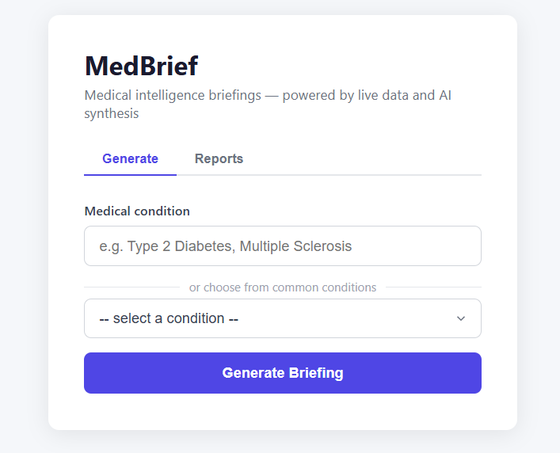

<div align="center">
  
</div>

# MedBrief

Enter a medical condition, get a 4-section research report with citations — streamed to the browser in real time.

**Sources:** ClinicalTrials.gov v2, PubMed/NCBI, OpenFDA, Anthropic web search

---

## Demo


*Generate a detailed intelligence briefing for any disease — covering standard of care, pipeline trials, FDA-approved therapies, key companies, and the latest clinical developments, all with verified citations.*

---

## Sample Reports

Reports generated by running MedBrief locally. Download the HTML file and open in any browser to read the full report.

| Condition | HTML Report | Raw JSON |
|---|---|---|
| Parkinson's Disease | [parkinson_s_disease_20260226_195534.html](medbrief/reports/parkinson_s_disease_20260226_195534.html) | [parkinson_s_disease_20260226_195534.json](medbrief/reports/parkinson_s_disease_20260226_195534.json) |
| Ulcerative Colitis | [ulcerative_colitis_20260226_194532.html](medbrief/reports/ulcerative_colitis_20260226_194532.html) | [ulcerative_colitis_20260226_194532.json](medbrief/reports/ulcerative_colitis_20260226_194532.json) |

---

## How It Works

### Pipeline (per request)

```
POST /generate
  └─ orchestrator.run_orchestrator()          background thread
       └─ ResearchLoop.run()                  up to 3 iterations
            ├─ iter 1: fetch all 4 sources in parallel
            ├─ iter 2: if data insufficient, Claude refines queries + retries
            └─ iter 3: force synthesis regardless
       └─ report_builder.build()
            ├─ pack raw data bundle → single Claude synthesis call
            ├─ Claude outputs ReportJSON (5 sections, structured)
            ├─ validate + strip any hallucinated citation indices
            └─ return complete report dict
       └─ push SSE events: status → section × 5 → complete
  └─ GET /stream/<sid>   SSE consumer in browser redirects to /report/<sid>
```

### Sufficiency Check (research loop)

Before committing to synthesis, the loop evaluates the data bundle:
- `≥ 2` clinical trials → emerging treatments dimension sufficient
- `≥ 2` PubMed articles → standard of care sufficient
- Web search returned text → recent developments sufficient

If insufficient at iteration 1, Claude rewrites the queries for iteration 2. Iteration 3 is forced synthesis regardless.

### Report Sections

| Section | Key | Primary sources |
|---|---|---|
| Condition Overview | `overview` | PubMed reviews, web search |
| Current Standard of Care | `standard_of_care` | OpenFDA labels, PubMed guidelines |
| Emerging Treatments | `emerging_treatments` | ClinicalTrials, PubMed trials |
| Key Companies & Institutions | `key_players` | ClinicalTrials sponsors, OpenFDA |
| Recent Developments | `recent_developments` | Web search (Anthropic tool) |

---

## File Structure

```
medbrief/
  app.py                  # Flask: 4 routes + SSE generator + session store
  orchestrator.py         # Pipeline controller; saves report JSON to reports/
  research_loop.py        # Fetch → sufficiency eval → repeat (max 3 iterations)
  report_builder.py       # Claude synthesis call → ReportJSON → HTML render
  citation_registry.py    # Dedup + index citations across all sources
  sources/
    clinicaltrials.py     # ClinicalTrials.gov API v2
    pubmed.py             # NCBI ESearch + EFetch (XML parse)
    openfda.py            # drug/label.json + drug/drugsfda.json
    web_search.py         # Anthropic web_search tool (claude-opus-4-6)
  templates/
    index.html            # Input form; SSE consumer; redirect on complete
    report.html           # Jinja2-rendered report with nav, tables, refs
  static/
    report.js             # SSE consumer for live-streaming variant
  reports/                # Auto-created; saved JSON + HTML output per run
  .env.example
  requirements.txt
```

---

## Setup

```bash
cd medbrief
pip install -r requirements.txt
cp .env.example .env      # fill in your keys
python app.py
```

Open `http://localhost:5000`.

---

## Environment

| Variable | Required | Notes |
|---|---|---|
| `ANTHROPIC_API_KEY` | Yes | Claude synthesis + web search tool |
| `NCBI_API_KEY` | No | PubMed: 10 req/s vs 3 req/s |
| `OPENFDA_API_KEY` | No | OpenFDA: 120k/day vs 1k/day |

Keys for ClinicalTrials.gov and Europe PMC are not required.

---

## API

| Route | Method | Description |
|---|---|---|
| `/` | GET | Input form |
| `/generate` | POST | Start pipeline; body: `{"condition": "breast cancer"}` |
| `/stream/<sid>` | GET | SSE: `status`, `loop_info`, `section`, `complete`, `error` |
| `/report/<sid>` | GET | Rendered HTML report |
| `/status/<sid>` | GET | `{"ready": bool}` — polled as SSE fallback |

---

## Data Integrity Rules

1. All approval claims scoped to FDA (US) only — never just "approved"
2. Citation indices cross-validated against registry before render — hallucinated ones stripped
3. Preprints flagged `[PREPRINT]` via PubMed `publication_types`
4. No dosing information included (enforced in synthesis prompt)
5. Report footer: jurisdiction caveat + "not for clinical use"

---

## Disclaimer

Not for clinical use. Report content is AI-generated and may be incomplete or inaccurate. Always consult a qualified healthcare professional.
